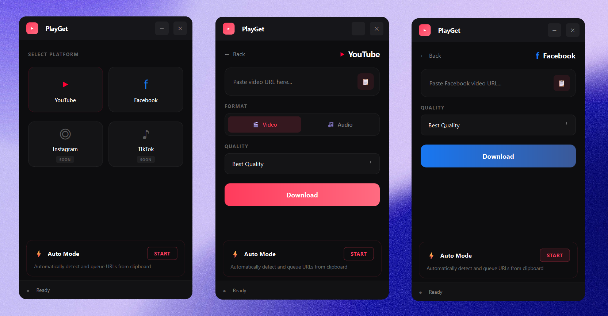

# PlayGet ▶

**Modern Video Downloader for Online Medias**



PlayGet is a sleek, dark-themed desktop application that lets you download videos and audio from YouTube, Facebook, Instagram, Tiktok, and more with ease.

## ✨ Features

*   **Multi-Platform Support**: Download from YouTube (Video/Audio) and other video platforms.
*   **Auto Mode ⚡**: Automatically detects links in your clipboard and adds them to the queue. Works in the background!
*   **High Quality**: Select resolutions up to 1080p+ or high-bitrate audio (320kbps).
*   **Modern UI**: Beautiful dark interface with smooth animations and a distraction-free design.
*   **Portable**: Single executable file - no installation required.

## 🚀 How to Use

1.  **Select Platform**: Choose YouTube or Facebook from the main menu.
2.  **Paste URL**: Click the paste button or use `Ctrl+V`.
    *   *Tip: Turn on Auto Mode (⚡) to skip this step! Just copy a link and it appears.*
3.  **Choose Quality**: Pick your preferred video resolution or audio bitrate.
4.  **Download**: Hit the button and watch it go.

## 🛠️ Installation / Running

**Download the latest release:**
Actually, just grab the `dist/PlayGet.exe` file. It's portable!

**Running from source:**
```bash
# Clone the repo
git clone https://github.com/yourusername/PlayGet.git

# Install dependencies
pip install -r requirements.txt

# Run the app
python app_gui.py
```

## 📦 Build it yourself

Want to modify it? You can build the executable yourself using the included script:
```bash
python build_exe.py
```
This generates a standalone `PlayGet.exe` in the `dist` folder.

## 📝 Credits

Powered by [yt-dlp](https://github.com/yt-dlp/yt-dlp) and [PyQt6](https://riverbankcomputing.com/software/pyqt/).
